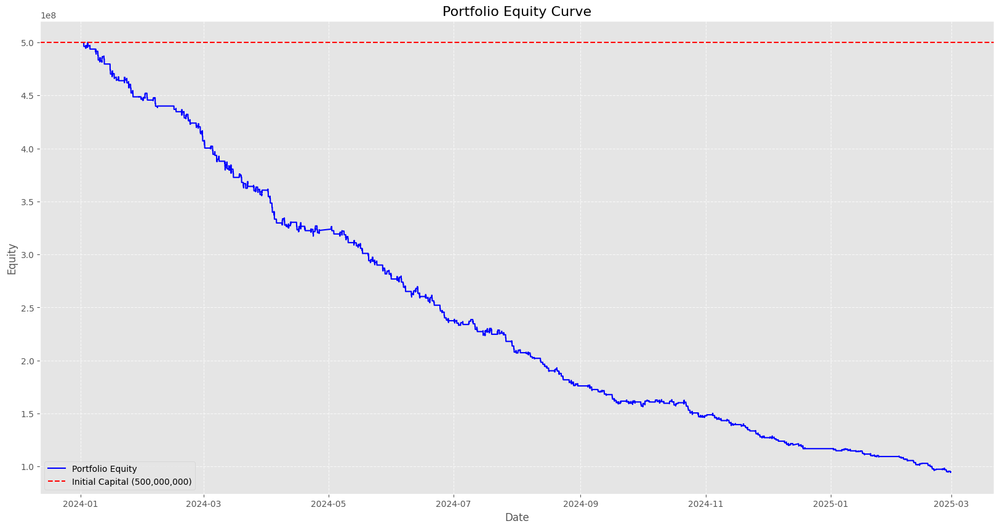
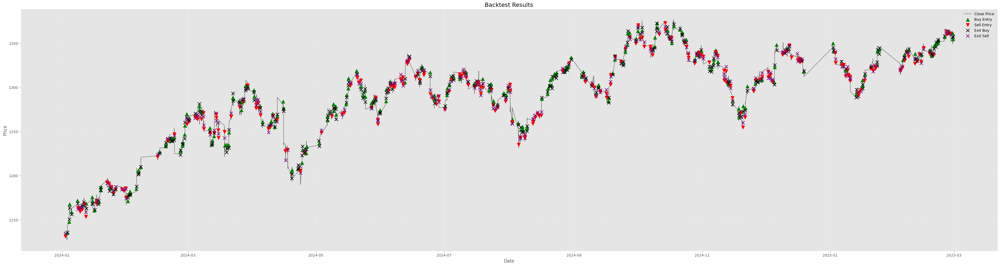
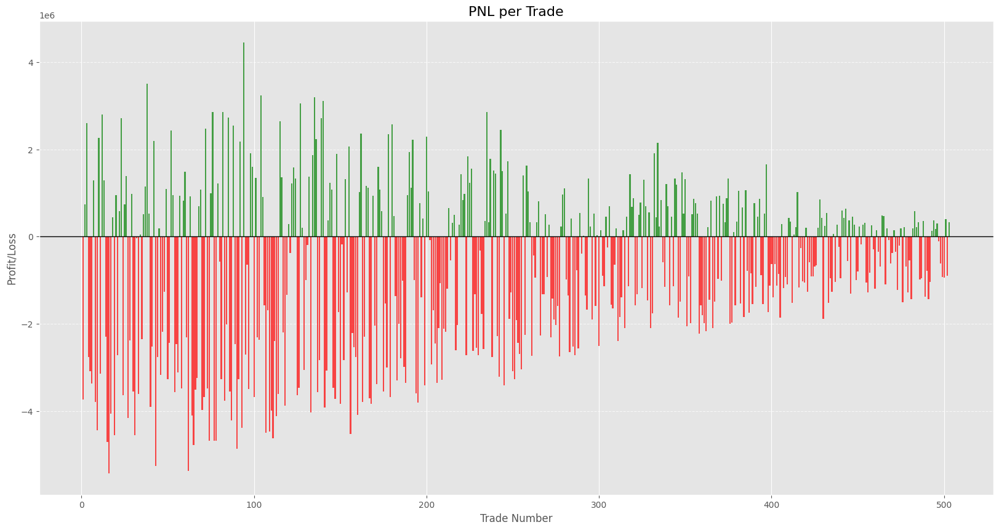
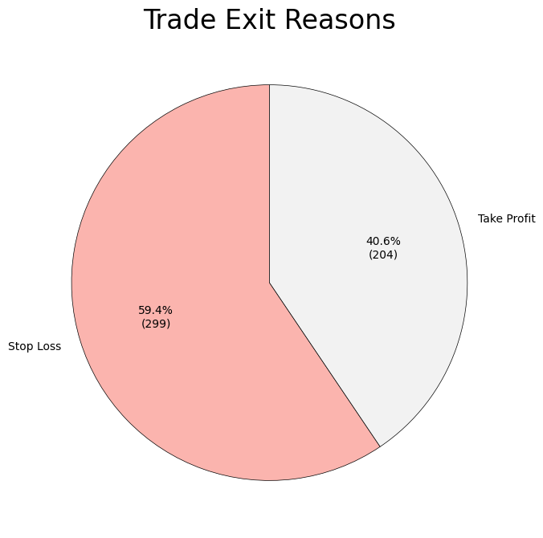

# Opening Range Breakout (ORB) Strategy

## Abstract
This repository implements an **Opening Range Breakout (ORB)** trading strategy specifically designed for the VN30F1M (Vietnam VN30 Index Futures). It takes advantage of early-session volatility by identifying an opening range and trading breakouts beyond this range. 

## Introduction
The Opening Range Breakout (ORB) strategy is a widely used intraday trading technique. It relies on the premise that the highest high and lowest low of the first few minutes of a trading session establish significant support and resistance levels. A breakout of this range often signals a strong intraday trend.

## Trading Hypothesis
The core hypothesis is that early morning or early afternoon sessions, when liquidity enters the market, create significant price movements. Once the market breaches the initial consolidation range, it tends to continue in the breakout direction.

### Target Market
- **Instrument**: VN30F1M (VN30 Index Futures)
- **Timeframe**: Tick-by-tick data, typically resampled to 5-minute OHLC bars.
- **Sessions**: The strategy accounts for the two distinct trading sessions in the Vietnamese market:
  - Morning Session: 09:00 - 11:30
  - Afternoon Session: 13:00 - 14:30

### Entry Conditions
An "opening range" is established during the first $N$ minutes (e.g., 15 minutes) of *each* session. The strategy waits for the range to form before generating any signals. Maximum of 1 trade per session.

#### Buy Signal (Bullish Hypothesis)
- **Condition**: $\text{Close price} > \text{Range High} + (\text{Breakout Buffer} \times \text{ATR})$
- **Logic**: A strong close above the opening range high, plus a volatility-adjusted buffer (ATR), indicates bullish momentum. 

#### Sell Signal (Bearish Hypothesis)
- **Condition**: $\text{Close price} < \text{Range Low} - (\text{Breakout Buffer} \times \text{ATR})$
- **Logic**: A strong close below the opening range low, minus a volatility-adjusted buffer, indicates bearish momentum. (Can be disabled via `long_only` mode).

### Indicators Used
- **Average True Range (ATR)**: Used for measuring volatility, determining the breakout buffer, evaluating range viability, and setting take profits / stop losses.
- **Volume Moving Average (Volume MA)** *(Optional)*: A volume filter ensuring breakouts are supported by above-average volume.
- **Average Directional Index (ADX)** *(Optional)*: A trend filter to ensure the breakout occurs in a sufficiently trending market environment before entering.

### Order Execution
- **Type**: Market Orders. The strategy enters immediately when the entry conditions are met.

### Exit Conditions
- **Stop Loss**: 
  - *Range-based SL*: Stop loss is placed at the opposite side of the opening range.
  - *ATR-based SL*: Fallback stop loss based on entry price minus (Multiplier * ATR).
- **Take Profit**: ATR-based. Take profit is set at a distance from the entry price equal to (Multiplier * ATR).
- **End of Day (EOD)**: All open positions are flattened at the end of the trading session by the engine's session manager.

---

## Installation

### Prerequisites

- Python 3.12+
- pip or conda

### Setup

1. **Clone the repository**

```bash
git clone https://github.com/rlukas2/BuyHigh-SellLow.git
cd BuyHigh-SellLow
```

2. **Create virtual environment**

```bash
python -m venv .venv

# On Windows
.venv\Scripts\activate

# On macOS/Linux
source .venv/bin/activate
```

3. **Install dependencies**

```bash
pip install -r requirements.txt
```

4. **Set up environment variables** (for database access)

```bash
cp .env.example .env
# Edit .env with your database credentials
```

5. **Load data** (requires database connection)

```bash
python -m src.run_data_loader
```

### Usage

#### Fetch/Load Data

```bash
python -m src.run_data_loader --mode [fetch|load] --sample [is|os] --contract [contract_name]

# Example: Fetch data for contract "VN30F1M"
python -m src.run_data_loader --mode fetch --contract VN30F1M
```

#### Run Backtest

```bash
python -m src.run_backtest --sample [is|os] --contract [contract_name] --config [config_file]
# Example: Run in-sample backtest for "VN30F1M"
python -m src.run_backtest --sample is --contract VN30F1M
# Example: Run out-of-sample backtest with optimized parameters
python -m src.run_backtest --sample os --contract VN30F1M --config config/strategy_params/optimized_params.json
```

#### Run Optimization

This will perform an Optuna optimization to find the best parameters for the strategy based on in-sample data.

```bash
python -m src.run_optimization --contract [contract_name]
```

#### Run Walk-Forward Analysis

```bash
python -m src.run_walk_forward --contract [contract_name]
```

### Parameter Configuration

Strategy parameters are defined in JSON files located in the `config/strategy_params/` directory.
You can create custom configurations or use the default one provided.

```json
{
  "strategy": {
    "resample_freq": "5min",
    "orb_minutes": 15,
    "atr_period": 14,
    "atr_tp_multiplier": 2.0,
    "atr_sl_multiplier": 1.5,
    "breakout_buffer": 0.1,
    "use_range_sl": true,
    "min_range_atr": 0.5,
    "max_range_atr": 3.0,
    "long_only": false,
    "use_volume_filter": false,
    "use_adx_filter": false,
    "adx_min": 20
  },
  "risk": {
    "min_position_size": 1,
    "max_position_size": 10,
    "risk_per_trade_pct": 1.0,
    "max_daily_loss": 0.02,
    "use_trailing_stop": true,
    "trailing_atr_multiplier": 2.0
  }
}
```

---

## Data

The strategy relies on high-quality tick-by-tick market data, specifically for the **VN30F1M** futures contract. Data management is handled by the `DataLoader` class, ensuring efficient retrieval and processing.

### Data Collection

By default, the system fetches **VN30F1M** tick-by-tick data from a PostgreSQL database. The data pipeline is designed for reliability and performance:

1.  **Database Querying**:
    -   **Matched Data**: The core query fetches trade execution data (`price`, `datetime`) from the `quote.matched` table. It joins with `quote.futurecontractcode` to filter for the specific future contract and `quote.total` to retrieve cumulative volume (`quantity`) at each tick.
    -   **Chunking**: To prevent timeouts and memory issues with large datasets, data is fetched in **30-day chunks**. These chunks are then concatenated into a single DataFrame.
    -   **Close Data**: Daily close prices are fetched separately from `quote.close` to provide reference points if needed.

2.  **Caching Mechanism**:
    -   The system implements a robust caching layer using **Parquet** files (`.parquet`) to minimize database load.
    -   **Load**: Before querying the database, the `DataLoader` checks the `data/cache/` directory for an existing file matching the request (contract name, start date, end date). If found, data is loaded instantly from the cache.
    -   **Save**: If data is fetched from the database, it is automatically saved to the cache for future runs.
    -   **Format**: Cache filenames follow a consistent pattern: `{contract}_{start}_{end}.parquet`.

### Data Processing

Raw tick data undergoes a rigorous preprocessing pipeline before being used in backtests. This is handled by the `Preprocessor` class:

1. **Cleaning**: remove duplicates, forward-fill missing prices, and drop rows with missing key timestamps.
2. **Feature Engineering**: derive per-tick volume from cumulative quantity and resample tick data into OHLC bars (e.g., 5min, 15min, 1h).
3. **Filtering**: restrict data to active trading hours (e.g., 09:00–14:30) unless ATC is requested.
4. **Indicators**: compute 20-period SMA with slope, 20-period Bollinger Bands (2.0 std), 20-period Volume MA, 14-period RSI, and 14-period ADX
---

## In-sample Backtesting

### Parameters

Using the default parameters defined in `config/strategy_params/orb_default.json`:
- Opening Range: 15 minutes
- ATR configurations: 14-period ATR, TP multiplier 2.0, SL multiplier 1.5
- Breakout Buffer: 0.1 ATR
- Range viability: Minimum 0.5 ATR, Maximum 3.0 ATR
- Long-only mode: Disabled (allows both long and short trades)
- Volume filter: Disabled
- ADX filter: Disabled
- Risk management: 1% risk per trade, max position size of 10 contracts, trailing stop enabled with a 2.0 ATR multiplier.

### Results

Period: January 1, 2024 - March 31, 2025 (in-sample period)

Performance Metrics:
| Metric                  | Value           |
| ----------------------- | --------------- |
| Total P&L               | -405,042,322.14 |
| Total Return (%)        | -81.0085        |
| Volatility (%)          | 16.4885         |
| Sharpe Ratio            | -9.0560         |
| Sortino Ratio           | -4.5209         |
| Max Drawdown (%)        | -81.1017        |
| Longest Drawdown (bars) | 13,773          |
| Total Trades            | 503             |
| Winning Trades          | 211             |
| Losing Trades           | 292             |
| Win Rate (%)            | 41.9483         |
| Average Win             | 1,033,020.54    |
| Average Loss            | 2,133,594.72    |

#### Equity Curve



#### Drawdown Curve



#### Trade Distribution



#### Exit Reasons



## Optimization

### Optimization Scoring Function

The strategy uses a custom composite objective function designed to balance risk-adjusted returns with drawdown and trade frequency.

1. **Score Calculation for each trials**:
$$
\text{Score} = \text{Sharpe} - |0.1 \times \text{Max Drawdown}| - \left|0.1 \times \frac{\text{Trades}}{1000}\right|
$$
- **Sharpe Ratio**: Rewards higher risk-adjusted returns.
- **Drawdown Penalty**: Penalizes strategies with large drawdowns, scaled by 0.1 to balance its influence.
- **Trade Frequency Penalty**: Penalizes strategies that overfit to noise by taking too many trades, scaled by 0.1 and normalized by 1000 to keep it in a comparable range with the Sharpe ratio.
2. **Additional Safeguards**:
- **Minimum Trade Penalty**: If total trades $\le 100$, the score defaults to `-10.0` to prevent overfitting to low-frequency noise.
- **Negative Sharpe Fallback**: If the Sharpe ratio is $\le 0$, `Total Return / 100` is used as a fallback score to help guide the optimizer toward positive expectancy.

### Process

We employ **Optuna (Tree-structured Parzen Estimator, TPE)** to search the strategy parameter space over `1000` trials globally.
Optimized parameters (from `src/run_optimization.py`):

- **Strategy parameters**
  - `resample_freq`: categorical → `5min`, `15min`, `1h`
  - `orb_minutes`: int range `15` to `60` (step `5`)
  - `atr_period`: int range `5` to `30` (step `1`)
  - `atr_tp_multiplier`: float range `1.5` to `6.0` (step `0.1`)
  - `atr_sl_multiplier`: float range `0.5` to `3.0` (step `0.1`)
  - `breakout_buffer`: float range `0.0` to `0.5` (step `0.05`)
  - `use_range_sl`: categorical → `True`, `False`
  - `min_range_atr`: float range `0.3` to `1.5` (step `0.1`)
  - `max_range_atr`: float range `2.0` to `5.0` (step `0.2`)
  - `long_only`: categorical → `True`, `False`
  - `use_volume_filter`: categorical → `True`, `False`
  - `use_adx_filter`: categorical → `True`, `False`
  - `adx_min`: float range `15.0` to `35.0` (step `1.0`)

- **Risk parameters**
  - `use_trailing_stop`: categorical → `True`, `False`
  - `trailing_atr_multiplier`: float range `1.0` to `4.0` (step `0.25`)


### Results

After optimization, the best parameters found were:

```json
{
  "strategy": {
    "resample_freq": "15min",
    "orb_minutes": 35,
    "atr_period": 11,
    "atr_tp_multiplier": 5.0,
    "atr_sl_multiplier": 0.5,
    "breakout_buffer": 0.25,
    "use_range_sl": false,
    "min_range_atr": 0.4,
    "max_range_atr": 2.4,
    "long_only": true,
    "use_volume_filter": true,
    "use_adx_filter": false,
    "adx_min": 28.0
  },
  "risk": {
    "min_position_size": 1,
    "max_position_size": 10,
    "risk_per_trade_pct": 1.0,
    "max_daily_loss": 0.02,
    "use_trailing_stop": false,
    "trailing_atr_multiplier": 1.0
  }
}
```

Performance Metrics:

| Metric                  | Value         |
| ----------------------- | ------------- |
| Total P&L               | 133,104,939.09 |
| Total Return (%)        | 26.6210       |
| Annualized Return (%)   | 24.0164       |
| CAGR (%)                | 24.0164       |
| Volatility (%)          | 13.6582       |
| Sharpe Ratio            | 1.6441        |
| Sortino Ratio           | 0.8590        |
| Max Drawdown (%)        | -7.9991       |
| Longest Drawdown (bars) | 1,665         |
| Total Trades            | 135           |
| Winning Trades          | 33            |
| Losing Trades           | 102           |
| Win Rate (%)            | 24.4444       |
| Profit Factor           | 1.4226        |
| Average Win             | 13,577,375.48 |
| Average Loss            | 3,087,729.92  |
| Information Ratio       | None          |

## Out-of-sample Backtesting

Period: April 1, 2025 - December 31, 2025 (out-of-sample period)

Performance Metrics:

| Metric                  | Value         |
| ----------------------- | ------------- |
| Total P&L               | 197,126,341.34 |
| Total Return (%)        | 39.4253       |
| Annualized Return (%)   | 54.5407       |
| CAGR (%)                | 54.5407       |
| Volatility (%)          | 26.1306       |
| Sharpe Ratio            | 1.7961        |
| Sortino Ratio           | 0.9970        |
| Max Drawdown (%)        | -13.4789      |
| Longest Drawdown (bars) | 781           |
| Total Trades            | 86            |
| Winning Trades          | 19            |
| Losing Trades           | 67            |
| Win Rate (%)            | 22.0930       |
| Profit Factor           | 1.5569        |
| Average Win             | 29,005,398.06 |
| Average Loss            | 5,283,227.19  |
| Information Ratio       | None          |


### Comparison: IS vs Optimized IS vs Optimized OOS

| Metric                | Default  | Optimized IS | Optimized OOS | Improvement                 | Improvement (%) |
| --------------------- | -------- | ------------ | ------------- | --------------------------- | --------------- |
| Total Return (%)      | -81.0085 | 26.6210      | 39.4253       | +120.4338 (OOS vs Default)  | +148.67%        |
| Annualized Return (%) | -77.8404 | 24.0164      | 54.5407       | +132.3811 (OOS vs Default)  | +170.07%        |
| Sharpe Ratio          | -9.0560  | 1.6441       | 1.7961        | +10.8521 (OOS vs Default)   | +119.83%        |
| Sortino Ratio         | -4.5209  | 0.8590       | 0.9970        | +5.5179 (OOS vs Default)    | +122.05%        |
| Max Drawdown (%)      | -81.1017 | -7.9991      | -13.4789      | +67.6228 (reduced drawdown) | +83.38%         |
| Profit Factor         | 0.3499   | 1.4226       | 1.5569        | +1.2070 (OOS vs Default)    | +345.05%        |
| Win Rate (%)          | 41.9483  | 24.4444      | 22.0930       | -19.8553 (OOS vs Default)   | -47.33%         |
| Total Trades          | 503      | 135          | 86            | -417 (OOS vs Default)       | -82.90%         |

> Note: Improvement values use **Optimized OOS vs Default IS** as the baseline. Percentage improvement is based on the absolute value of the default metric when the default metric is negative.