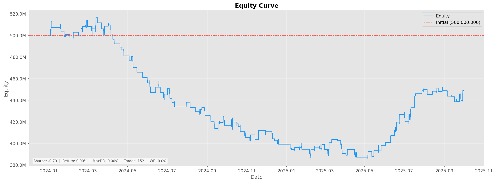
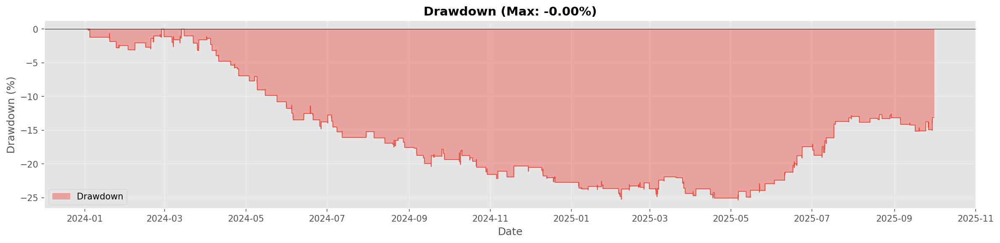
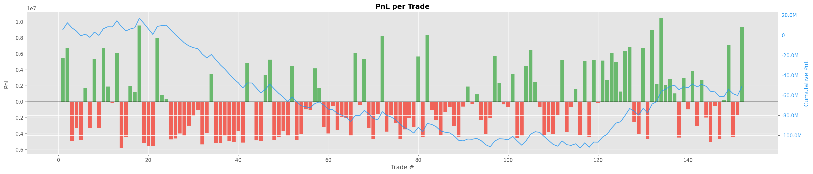
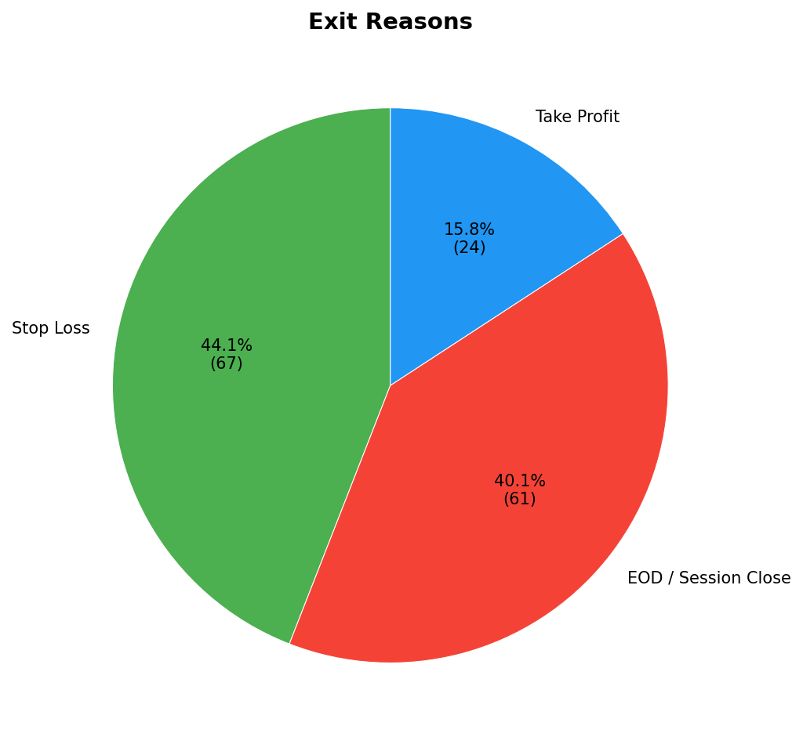
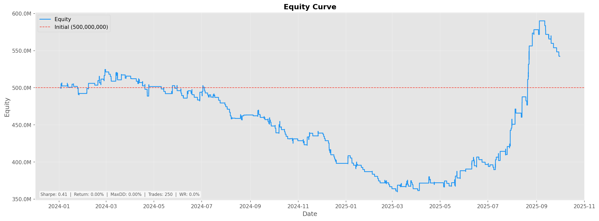
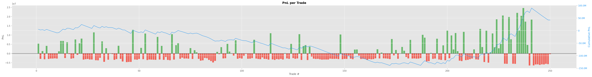
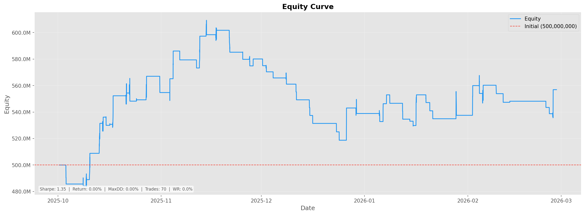
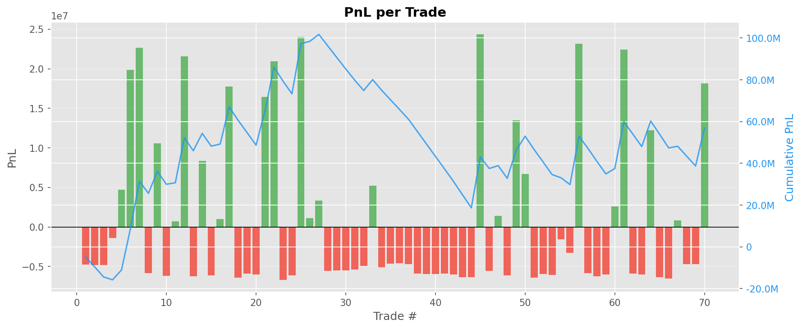

# Opening Range Breakout (ORB) Strategy

<!--toc:start-->
- [Opening Range Breakout (ORB) Strategy](#opening-range-breakout-orb-strategy)
  - [Abstract](#abstract)
  - [Introduction](#introduction)
  - [Trading Hypothesis](#trading-hypothesis)
    - [Target Market](#target-market)
    - [Entry Conditions](#entry-conditions)
      - [Buy Signal (Bullish Hypothesis)](#buy-signal-bullish-hypothesis)
      - [Sell Signal (Bearish Hypothesis)](#sell-signal-bearish-hypothesis)
    - [Indicators Used](#indicators-used)
    - [Order Execution](#order-execution)
    - [Exit Conditions](#exit-conditions)
    - [Adaptive Volatility Adjustment](#adaptive-volatility-adjustment)
  - [Installation](#installation)
    - [Prerequisites](#prerequisites)
    - [Setup](#setup)
    - [Usage](#usage)
      - [Fetch/Load Data](#fetchload-data)
      - [Run Backtest](#run-backtest)
      - [Run Walk-Forward Analysis](#run-walk-forward-analysis)
    - [Parameter Configuration](#parameter-configuration)
  - [Data](#data)
    - [Data Collection](#data-collection)
    - [Data Processing](#data-processing)
  - [In-sample Backtesting](#in-sample-backtesting)
    - [Parameters](#parameters)
    - [Results](#results)
      - [Equity Curve](#equity-curve)
      - [Drawdown Curve](#drawdown-curve)
      - [Trade Distribution](#trade-distribution)
      - [Exit Reasons](#exit-reasons)
  - [Optimization](#optimization)
    - [Optimization Scoring Function](#optimization-scoring-function)
    - [Process](#process)
    - [Results](#results-1)
  - [Out-of-sample Backtesting](#out-of-sample-backtesting)
    - [Comparison: IS vs Optimized IS vs Optimized OOS](#comparison-is-vs-optimized-is-vs-optimized-oos)
  - [Reference](#reference)
<!--toc:end-->

## Abstract

This repository implements an **Opening Range Breakout (ORB)** trading strategy specifically designed for the VN30F1M (Vietnam VN30 Index Futures). It takes advantage of early-session volatility by identifying an opening range and trading breakouts beyond this range.

## Introduction

The Opening Range Breakout (ORB) strategy is a widely used intraday trading technique. It relies on the premise that the highest high and lowest low of the first few minutes of a trading session establish significant support and resistance levels. A breakout of this range often signals a strong intraday trend.

## Trading Hypothesis

The core hypothesis is that the first few minutes of each trading session establish a consolidation range that represents the market's initial equilibrium. When price breaks out of this range with sufficient momentum (measured by ATR-adjusted buffer), it signals a directional move that tends to continue during the session. The strategy capitalizes on this momentum while using volatility-based filters to avoid false breakouts.

### Target Market

- **Instrument**: VN30F1M (VN30 Index Futures)
- **Timeframe**: 1-minute tick data aggregated and resampled to configurable OHLC bars (default: 15-minute bars)
- **Sessions**: The strategy accounts for the two distinct trading sessions in the Vietnamese market:
  - Morning Session: 09:00 - 11:30 (150 minutes)
  - Afternoon Session: 13:00 - 14:30 (90 minutes)
  - ATC Session: 14:30 - 14:45 (order execution only, no new signals)

### Entry Conditions

An "opening range" is established during the first $N$ minutes (default: 20 minutes) of *each* session by tracking the highest high and lowest low. The strategy waits for the range to form before generating any signals. Maximum of 1 trade per session by default (configurable via `max_trades_per_session`).

#### Buy Signal (Bullish Hypothesis)

- **Condition**:
  - With close confirmation (default): $\text{Close} > \text{Range High} + (\text{Breakout Buffer} \times \text{ATR})$
  - Without close confirmation: $\text{High} > \text{Range High} + (\text{Breakout Buffer} \times \text{ATR})$
- **Logic**: A breakout above the opening range high, plus a volatility-adjusted buffer, indicates bullish momentum. Close confirmation requires the bar to close beyond the breakout level, reducing false signals.
- **Order Type**: Configurable as MARKET (default) or LIMIT orders

#### Sell Signal (Bearish Hypothesis)

- **Condition**:
  - With close confirmation (default): $\text{Close} < \text{Range Low} - (\text{Breakout Buffer} \times \text{ATR})$
  - Without close confirmation: $\text{Low} < \text{Range Low} - (\text{Breakout Buffer} \times \text{ATR})$
- **Logic**: A breakout below the opening range low, minus a volatility-adjusted buffer, indicates bearish momentum. Can be disabled via `long_only` mode.
- **Order Type**: Configurable as MARKET (default) or LIMIT orders

### Indicators Used

- **Average True Range (ATR)**: Core volatility measure used for:
  - Breakout buffer calculation (filters noise)
  - Range viability assessment (min/max range size in ATR units)
  - Stop loss and take profit placement
  - Adaptive volatility regime detection
- **Volume Moving Average (Volume MA)** *(Optional)*: Ensures breakouts are supported by above-average volume (configurable threshold)
- **Average Directional Index (ADX)** *(Optional)*: Trend strength filter to avoid trading in choppy, non-trending markets (configurable minimum threshold)
- **ATR Moving Average** *(Adaptive Mode)*: Used to detect volatility regimes (low/normal/high) for dynamic parameter adjustment

### Order Execution

- **Type**: Configurable via `entry_ord_type` parameter:
  - **MARKET** (default): Enters immediately at next bar's open when conditions are met
  - **LIMIT**: Places limit order at breakout level (more conservative, may miss some trades)
- **Entry Cutoff**: Configurable time window before session end (default: 300 seconds) to avoid late entries
- **Late Entry Control**: Can allow or disallow entries near session close via `allow_late_entry` flag

### Exit Conditions

- **Stop Loss**:
  - *Range-based SL* (default, `use_range_sl=true`): Stop loss is placed at the opposite side of the opening range (range low for longs, range high for shorts)
  - *ATR-based SL* (`use_range_sl=false`): Stop loss based on entry price ± (atr_sl_multiplier × ATR)
- **Take Profit**: Always ATR-based. Take profit is set at entry price ± (atr_tp_multiplier × ATR)
- **Trailing Stop** *(Optional)*: Dynamic stop loss that trails price by (trailing_atr_multiplier × ATR) when enabled
- **End of Session (EOS)**: All open positions are automatically flattened at session close (14:30 for afternoon session)
- **Max Daily Loss**: Circuit breaker that stops trading if daily loss exceeds configured percentage

### Adaptive Volatility Adjustment

When `use_adaptive_volatility` is enabled, the strategy dynamically adjusts parameters based on current volatility regime:

- **Volatility Regime Detection**: Compares current ATR to its moving average (lookback period: 20 bars)
  - **Low Volatility** (ATR < 70% of average): Relaxes range filters (×0.7) and tightens breakout buffer (×0.7) to capture moves in quiet markets
  - **Normal Volatility** (70% ≤ ATR ≤ 130%): Uses configured parameters as-is
  - **High Volatility** (ATR > 130% of average): Tightens range filters (×1.3) and widens breakout buffer (×1.3) to avoid false breakouts in volatile markets

This adaptive mechanism helps the strategy maintain consistent performance across different market conditions without manual parameter tuning.

---

## Installation

### Prerequisites

- Python 3.13+
- pip or uv (recommended)

### Setup

1. **Clone the repository**

```bash
git clone https://github.com/rlukas2/BuyHigh-SellLow.git
cd BuyHigh-SellLow
```

2. **Create virtual environment**

```bash
python -m venv .venv

# On Windows
.venv\Scripts\activate

# On macOS/Linux
source .venv/bin/activate
```

3. **Install dependencies**

The project uses `pyproject.toml` with optional dependency groups:

```bash
# Install core dependencies only (data loading, backtesting)
pip install -e .

# Install with optimization support (Optuna)
pip install -e ".[optimization]"

# Install with visualization support (matplotlib, seaborn)
pip install -e ".[viz]"

# Install with all optional dependencies (recommended for development)
pip install -e ".[all]"

# Or install specific groups
pip install -e ".[optimization,viz]"
```

**Dependency Groups:**
- `optimization`: Optuna, tqdm (for parameter optimization)
- `paper`: Redis, httpx (for paper trading)
- `viz`: matplotlib, seaborn (for plotting)
- `dev`: pytest, ruff, mypy, pre-commit (for development)
- `all`: All of the above

4. **Set up environment variables** (for database access)

```bash
cp .env.example .env
# Edit .env with your database credentials
```

5. **Fetch data** (requires database connection)

```bash
python -m src.run_data_loader fetch --symbol VN30F1M --start 2024-01-01 --end 2025-03-31
```

### Usage

#### Fetch/Load Data

The data loader operates in multiple modes for different data management tasks:

**Fetch Mode** - Retrieve data from database and cache as monthly parquet files:
```bash
# Fetch data for a date range
python -m src.run_data_loader fetch --symbol VN30F1M --start 2024-01-01 --end 2025-03-31

# Force refresh specific months (ignores cache)
python -m src.run_data_loader fetch --symbol VN30F1M --start 2024-01-01 --end 2025-03-31 --force-months 2024_01,2024_02

# Force refresh all data (bypass cache completely)
python -m src.run_data_loader fetch --symbol VN30F1M --start 2024-01-01 --end 2025-03-31 --force-refresh
```

**Inspect Mode** - View cached data statistics and sample rows:
```bash
python -m src.run_data_loader inspect --symbol VN30F1M --start 2024-01-01 --end 2025-03-31
```

**Validate Mode** - Check data quality (OHLC relationships, gaps, anomalies):
```bash
python -m src.run_data_loader validate --symbol VN30F1M --start 2024-01-01 --end 2025-03-31
```

**Stats Mode** - View statistics after preprocessing and resampling:
```bash
python -m src.run_data_loader stats --symbol VN30F1M --start 2024-01-01 --end 2025-03-31 --freq 15min
```

**Import CSV Mode** - One-time migration from legacy tick CSV files:
```bash
python -m src.run_data_loader import-csv --path "data/ticks_*.csv" --symbol VN30F1M
```

**Clear Cache Mode** - Remove cached data:
```bash
# Clear specific month
python -m src.run_data_loader clear-cache --symbol VN30F1M --month 2024_01

# Clear all months for a symbol
python -m src.run_data_loader clear-cache --symbol VN30F1M

# Clear all cache (all symbols)
python -m src.run_data_loader clear-cache
```

**Data Caching System:**
- Data is fetched from PostgreSQL database and cached as monthly parquet files
- Cache location: `data/cache/<symbol>/1min/<YYYY_MM>.parquet`
- Incremental fetching: Current month is automatically updated with new data
- Past months are marked complete and never refetched (unless forced)
- Manifest file tracks cache metadata: `data/cache/<symbol>/manifest.json`

#### Run Backtest

Run a backtest for the specified strategy and date range:

```bash
# Basic backtest with default config
python -m src.run_backtest --strategy orb --start 2024-01-01 --end 2025-03-31

# With custom config file
python -m src.run_backtest --strategy orb --start 2024-01-01 --end 2025-03-31 \
    --config config/strategy_params/orb_aggressive.json

# With specific symbol and frequency
python -m src.run_backtest --strategy orb --symbol VN30F1M --start 2024-01-01 --end 2025-03-31 \
    --freq 15min

# Force refresh data and indicators (bypass cache)
python -m src.run_backtest --strategy orb --start 2024-01-01 --end 2025-03-31 --force-refresh

# Generate interactive HTML plots instead of PNG
python -m src.run_backtest --strategy orb --start 2024-01-01 --end 2025-03-31 --plot-html

# Show trade details in console
python -m src.run_backtest --strategy orb --start 2024-01-01 --end 2025-03-31 --show-trades

# Compare engine implementations (validation)
python -m src.run_backtest --strategy orb --start 2024-01-01 --end 2025-03-31 --compare-engines

# Run Monte Carlo simulation on trade results
python -m src.run_backtest --strategy orb --start 2024-01-01 --end 2025-03-31 \
    --monte-carlo --mc-simulations 10000
```

**Backtest Pipeline:**
1. **Execute pending orders** at current bar open (or limit logic), including order TTL expiration handling
2. **Manage positions** via stop-loss/take-profit checks, then EOS forced close if session requires
3. **Generate new signals** (if session allows), convert signal to order and queue as pending
4. **Mark-to-market** and record equity

**Output:**
- Results saved to: `results/<strategy>_<timestamp>/`
- Files: `result.json`, `equity.parquet`, `trades.parquet`, `plots/`

#### Run Walk-Forward Analysis

Walk-Forward Analysis validates strategy robustness across different market regimes:

```bash
# Anchored walk-forward with default settings (5 windows, 70% train)
python -m src.run_walk_forward --strategy orb --start 2022-01-01 --end 2024-12-31

# Rolling windows with more trials per window
python -m src.run_walk_forward --strategy orb --mode rolling --n-windows 6 --n-trials 150

# With grid search optimizer instead of Optuna
python -m src.run_walk_forward --strategy orb --optimizer grid --n-windows 5

# Custom train/test split
python -m src.run_walk_forward --strategy orb --train-pct 0.8 --n-windows 4

# With embargo period between train/test
python -m src.run_walk_forward --strategy orb --embargo-bars 10
```

**Walk-Forward Modes:**
- **Anchored** (default): Training set grows with each window, test set slides forward
- **Rolling**: Both training and test sets slide forward with fixed size

**Output:**
- Results saved to: `results/walk_forward/`
- Files: `wfo_summary.json`, `window_results.parquet`, `equity_curve.png`

### Parameter Configuration

Strategy parameters are defined in JSON files located in the `config/strategy_params/` directory.
You can create custom configurations or use the default one provided.

**Default Configuration** (`orb_default.json`):

```json
{
  "strategy": {
    "resample_freq": "15min",
    "orb_minutes": 15,
    "atr_period": 14,
    "atr_tp_multiplier": 3.0,
    "atr_sl_multiplier": 1.5,
    "breakout_buffer": 0.5,
    "use_range_sl": true,
    "min_range_atr": 0.5,
    "max_range_atr": 3.0,
    "long_only": true,
    "use_volume_filter": true,
    "volume_filter_threshold": 0.5,
    "volume_ma_period": 20,
    "use_adx_filter": true,
    "adx_period": 14,
    "adx_min": 20,
    "require_close_confirmation": true,
    "max_trades_per_session": 1,
    "use_adaptive_volatility": true,
    "atr_lookback_period": 20,
    "volatility_low_threshold": 0.7,
    "volatility_high_threshold": 1.3,
    "low_vol_range_multiplier": 0.7,
    "high_vol_range_multiplier": 1.3,
    "low_vol_buffer_multiplier": 0.7,
    "high_vol_buffer_multiplier": 1.3
  },
  "risk": {
    "min_position_size": 1,
    "max_position_size": 10,
    "risk_per_trade_pct": 1.0,
    "max_daily_loss": 2.0,
    "use_trailing_stop": true,
    "trailing_atr_multiplier": 2.0,
    "entry_cutoff_seconds": 300,
    "allow_late_entry": false,
    "force_flat_on_session_close": true,
    "defer_exit_outside_session": true,
    "entry_ord_type": "MARKET"
  }
}
```

**Key Parameters:**
- `resample_freq`: Bar frequency (1min, 5min, 15min, 30min)
- `orb_minutes`: Opening range duration in minutes
- `atr_period`: ATR calculation period
- `atr_tp_multiplier`: Take profit distance in ATR units
- `atr_sl_multiplier`: Stop loss distance in ATR units (when not using range SL)
- `breakout_buffer`: Additional buffer beyond range in ATR units
- `require_close_confirmation`: Require bar close beyond breakout level
- `use_adaptive_volatility`: Enable dynamic parameter adjustment based on volatility regime
- `entry_ord_type`: Order type for entries (MARKET or LIMIT)

---

## Data

The strategy relies on high-quality tick-by-tick market data, specifically for the **VN30F1M** futures contract. Data management is handled by the `DataLoader` class with a robust monthly caching system for efficient retrieval and processing.

### Data Collection

By default, the system fetches **VN30F1M** tick-by-tick data from a PostgreSQL database. The data pipeline is designed for reliability, performance, and incremental updates:

1. **Database Querying**:
    - **Matched Data**: The core query fetches trade execution data (`price`, `datetime`) from the `quote.matched` table. It joins with `quote.futurecontractcode` to filter for the specific future contract and `quote.total` to retrieve cumulative volume (`quantity`) at each tick.
    - **Monthly Chunking**: Data is fetched and cached in **monthly chunks** (one parquet file per month) to optimize storage and retrieval. Each month is stored as `data/cache/<symbol>/1min/<YYYY_MM>.parquet`.
    - **Incremental Fetching**: For the current month, the system tracks the last synced timestamp and only fetches new data from that point forward, avoiding redundant downloads.
    - **Close Data**: Daily close prices are fetched separately from `quote.close` to provide reference points if needed.

2. **Caching Mechanism**:
    - The system implements a robust caching layer using **Parquet** files (`.parquet`) with monthly granularity to minimize database load.
    - **Manifest Tracking**: A JSON manifest file (`manifest.json`) tracks which months are cached, their row counts, data sources, completion status, and last synced timestamps.
    - **Load**: Before querying the database, the `DataLoader` checks the cache directory for existing monthly files. If found and marked complete, data is loaded instantly from cache.
    - **Save**: If data is fetched from the database, it is automatically saved to the cache as monthly parquet files for future runs.
    - **Incremental Updates**: Current month is always refetched to capture new data, while past months are marked complete and never refetched (unless forced).
    - **Format**: Cache filenames follow the pattern: `<YYYY_MM>.parquet` (e.g., `2024_03.parquet`)

3. **Cache Management**:
    - **Validation**: Cached files are validated for schema correctness and data integrity on load
    - **Invalidation**: Corrupt or outdated cache files are automatically detected and refetched
    - **Force Refresh**: Specific months or entire cache can be force-refreshed via CLI flags
    - **Staleness Check**: Optional max age parameter to automatically refetch old cache entries

### Data Processing

Raw tick data undergoes a rigorous preprocessing pipeline before being used in backtests. This is handled by the `DataPreprocessor` class:

1. **Tick Aggregation**:
   - Tick data is aggregated to 1-minute OHLCV bars
   - Volume is computed correctly by handling cumulative volume within each trading day
   - First tick of each day uses cumulative value; subsequent ticks use diff

2. **Cleaning**:
   - Remove duplicates by datetime (keep last)
   - Forward-fill missing prices
   - Drop rows with missing key timestamps
   - Clip negative volumes (data corruption handling)

3. **Resampling**:
   - 1-minute bars are resampled to target frequency (5min, 15min, 30min, etc.)
   - OHLC aggregation: first open, max high, min low, last close
   - Volume aggregation: sum of volumes

4. **Session Filtering**:
   - Restrict data to active trading hours (09:00-14:30 for VN30)
   - Optionally include ATC session (14:30-14:45) if requested
   - Remove bars outside trading sessions

5. **Indicator Computation**:
   - 14-period ATR (Average True Range)
   - 14-period ADX (Average Directional Index)
   - 20-period Volume MA (Moving Average)
   - 20-period ATR MA (for adaptive volatility detection)
   - All indicators computed via `DataPipeline` with disk caching for performance

---

## In-sample Backtesting

### Parameters

Using the default parameters defined in `config/strategy_params/orb_default.json`:

- **Timeframe**: 15-minute bars (resampled from 1-minute data)
- **Opening Range**: 20 minutes (first 20 minutes of each session)
- **ATR Configuration**:
  - Period: 14 bars
  - Take Profit: 3.0× ATR
  - Stop Loss: 1.5× ATR (fallback when not using range SL)
- **Breakout Buffer**: 0.5× ATR (additional buffer beyond range to confirm breakout)
- **Range Viability**:
  - Minimum: 0.5× ATR (filters out too-narrow ranges)
  - Maximum: 3.0× ATR (filters out too-wide ranges)
- **Direction**: Long-only mode enabled (no short trades)
- **Filters**:
  - Volume filter: Enabled (requires volume > 50% of 20-period MA)
  - ADX filter: Enabled (requires ADX > 20 for trend confirmation)
- **Entry**:
  - Close confirmation required (bar must close beyond breakout level)
  - Order type: MARKET
  - Entry cutoff: 300 seconds before session end
- **Exit**:
  - Stop loss: Range-based (opposite side of opening range)
  - Trailing stop: Enabled (2.0× ATR)
  - Max daily loss: 2.0% circuit breaker
- **Adaptive Volatility**: Enabled
  - ATR lookback: 20 bars
  - Low volatility threshold: 0.7 (70% of average ATR)
  - High volatility threshold: 1.3 (130% of average ATR)
  - Range multipliers: 0.7× (low vol) / 1.3× (high vol)
  - Buffer multipliers: 0.7× (low vol) / 1.3× (high vol)
- **Risk Management**:
  - Risk per trade: 1.0% of capital
  - Position size: 1-10 contracts
  - Max trades per session: 1

### Results

Period: January 1, 2024 - September 30, 2025 (in-sample period, 21 months)

Performance Metrics:

| Metric                  | Value       |
| ----------------------- | ----------- |
| Total P&L               | -50,895,152 |
| Total Commission        | 49,149,908  |
| Total Return (%)        | -10.1790    |
| Annualized Return (%)   | -6.1885     |
| Volatility (%)          | 8.6527      |
| Sharpe Ratio            | -0.6951     |
| Sortino Ratio           | -0.2381     |
| Max Drawdown (%)        | -25.3623    |
| Longest Drawdown (bars) | 6,370       |
| Total Trades            | 152         |
| Winning Trades          | 57          |
| Losing Trades           | 95          |
| Win Rate (%)            | 37.5        |
| Average Win             | 4,488,738   |
| Average Loss            | 3,222,981   |

#### Equity Curve



#### Drawdown Curve



#### Trade Distribution



#### Exit Reasons



## Optimization

### Optimization Scoring Function

The hybrid optimizer uses the shared composite scorer (see `src/optimization/scoring.py`). Each trial is filtered by hard gates, then scored with a risk-adjusted base and penalties/bonus.

1. **Hard gates (invalid score if any fail)**:

- `total_trades < min_trades`
- `total_return_pct < min_return_pct`
- `net_profit_factor < min_profit_factor`
- `win_rate_pct < min_win_rate_pct`

2. **Base score selection**:

$$
\text{base} =
\begin{cases}
\text{Sharpe}, & \text{if Sharpe} > 0 \\
0.9 \times \text{Sortino}, & \text{if Sharpe} \le 0 \text{ and Sortino} > 0 \\
\text{Total Return} / 10, & \text{otherwise}
\end{cases}
$$

3. **Composite score**:

$$
\text{Score} = \text{base} - \text{drawdown penalty} \times \frac{\text{Max Drawdown (\%)}}{10} - \text{turnover penalty} \times \frac{\text{Trades}}{1000} + \text{trade count bonus} \times \min\left(\frac{\text{Trades}}{1000}, \text{trade bonus cap}\right)
$$

- Drawdown is normalized so 10% DD is about 1.0 penalty unit on a Sharpe-like scale.
- The trade bonus is capped to avoid over-rewarding high-frequency behavior.

**Why this scoring mix**: The goal is to favor risk-adjusted return first, then control tail risk and overtrading, while still rewarding enough sample size to reduce variance in the estimate.

**Term meanings (short)**:

- `Sharpe` / `Sortino`: risk-adjusted return; Sortino is used only when Sharpe is non-positive.
- `Total Return / 10`: fallback so scores remain on a Sharpe-like scale.
- `drawdown_penalty`: penalizes deep drawdowns (10% DD ~= 1 score unit).
- `turnover_penalty`: discourages excessive trade counts (per 1000 trades).
- `trade_count_bonus`: small bonus for sufficient trade volume; capped by `trade_bonus_cap`.

**Hybrid runner defaults** (`src/run_optimize_hybrid.py`):

- Hard gates: `min_trades=120` (phase 1 uses `max(30, min_trades/3)`, phase 2 uses `max(50, min_trades/2)`), `min_return_pct=-999`, `min_profit_factor=-999`, `min_win_rate_pct=0`.
- Weights: `drawdown_penalty=0.3`, `trade_count_bonus=0.1`, `turnover_penalty=0`, `trade_bonus_cap=1.0`.

### Process

We employ **Optuna (Tree-structured Parzen Estimator, TPE)** via the hybrid runner in `src/run_optimize_hybrid.py`. It combines global discovery with local refinement:

- **Phase 1 (discovery)**: Split the trial budget between a core-only branch (adaptive disabled) and an adaptive-enabled branch.
- **Phase 2 (local refine)**: Take top seeds from both branches and run neighborhood searches around each seed (categoricals frozen, numeric ranges shrunk by `--local-radius`).
- **Phase 3 (final polish)**: One more neighborhood search around the best phase-2 candidate.
- **Optional**: Filter winners to a target trade-count band (`--target-trades-min/--target-trades-max`).

Optimized parameters (from `src/run_optimize_hybrid.py`):

- **Strategy parameters**
  - `resample_freq`: categorical → `15min` (fixed)
  - `orb_minutes`: int range `0` to `30` (step `15`)
  - `atr_period`: int range `14` to `30`
  - `atr_tp_multiplier`: float range `1.0` to `4.0` (step `0.05`)
  - `atr_sl_multiplier`: float range `0.5` to `2.0` (step `0.05`)
  - `breakout_buffer`: float range `0.0` to `1.0` (step `0.05`)
  - `require_close_confirmation`: categorical → `True` (fixed)
  - `use_range_sl`: categorical → `True`, `False`
  - `min_range_atr`: float range `0.3` to `2.0` (step `0.1`)
  - `max_range_atr`: float range `2.0` to `6.0` (step `0.1`)
  - `long_only`: categorical → `False` (fixed)
  - `max_trades_per_session`: int range `1` to `3`
  - `use_volume_filter`: categorical → `True`, `False`
  - `use_adx_filter`: categorical → `True`, `False`
  - `adx_min`: float range `15.0` to `35.0` (step `1.0`)
  - `use_adaptive_volatility`: categorical → `True`, `False`
  - `atr_lookback_period`: int range `10` to `30` (step `5`)
  - `volatility_low_threshold`: float range `0.6` to `0.85` (step `0.05`)
  - `volatility_high_threshold`: float range `1.2` to `1.5` (step `0.05`)
  - `low_vol_range_multiplier`: float range `0.5` to `0.9` (step `0.1`)
  - `high_vol_range_multiplier`: float range `1.1` to `1.5` (step `0.1`)
  - `low_vol_buffer_multiplier`: float range `0.5` to `0.9` (step `0.1`)
  - `high_vol_buffer_multiplier`: float range `1.1` to `1.5` (step `0.1`)

- **Risk parameters**
  - `use_trailing_stop`: categorical → `True`, `False`
  - `trailing_atr_multiplier`: float range `1.0` to `4.0` (step `0.25`)
  - `entry_ord_type`: categorical → `LIMIT` (fixed)

### Results

After hybrid optimization, the best config is saved to `config/strategy_params/orb_hybrid_best_final_<timestamp>.json`. A leaderboard CSV is also written under `results/optimization/`.

Example best config (latest saved):

```json
{
  "name": "Opening Range Breakout (ORB) Strategy",
  "version": "2.0.0",
  "strategy": {
    "resample_freq": "15min",
    "orb_minutes": 30,
    "atr_period": 29,
    "atr_tp_multiplier": 3.45,
    "atr_sl_multiplier": 1.4000000000000001,
    "breakout_buffer": 0.35,
    "use_range_sl": false,
    "min_range_atr": 1.2,
    "max_range_atr": 5.6000000000000005,
    "long_only": false,
    "use_volume_filter": true,
    "volume_filter_threshold": 0.5,
    "volume_ma_period": 20,
    "use_adx_filter": false,
    "adx_period": 14,
    "adx_min": 27.0,
    "require_close_confirmation": true,
    "max_trades_per_session": 2,
    "use_adaptive_volatility": true,
    "atr_lookback_period": 10,
    "volatility_low_threshold": 0.85,
    "volatility_high_threshold": 1.4,
    "low_vol_range_multiplier": 0.6,
    "high_vol_range_multiplier": 1.2,
    "low_vol_buffer_multiplier": 0.5,
    "high_vol_buffer_multiplier": 1.2
  },
  "risk": {
    "min_position_size": 1,
    "max_position_size": 10,
    "risk_per_trade_pct": 2.5,
    "max_daily_loss": 2.0,
    "use_trailing_stop": true,
    "trailing_atr_multiplier": 3.0,
    "entry_cutoff_seconds": 300,
    "allow_late_entry": false,
    "force_flat_on_session_close": true,
    "defer_exit_outside_session": true,
    "entry_ord_type": "LIMIT"
  }
}
```

Example performance metrics (from one hybrid run):

| Metric                  | Value      |
| ----------------------- | ---------- |
| Total P&L               | 42,222,756 |
| Total Commission        | 99,854,505 |
| Total Return (%)        | 8.4446     |
| Annualized Return (%)   | 4.9425     |
| Volatility (%)          | 13.9662    |
| Sharpe Ratio            | 0.4149     |
| Sortino Ratio           | 0.1862     |
| Max Drawdown (%)        | -31.4132   |
| Longest Drawdown (bars) | 6,123      |
| Total Trades            | 250        |
| Winning Trades          | 82         |
| Losing Trades           | 168        |
| Win Rate (%)            | 32.8000    |
| Profit Factor           | 1.0802     |
| Average Win             | 6,937,931  |
| Average Loss            | 3,135,045  |





## Out-of-sample Backtesting

Period: October 1, 2025 - February 28, 2026 (out-of-sample period, 5 months)

**Note on OOS Performance**: The out-of-sample period coincides with heightened global geopolitical tensions and market volatility (2026 political developments, ongoing conflicts), which may have created favorable conditions for breakout strategies. The strong OOS performance should be interpreted within this specific market context rather than as a general expectation.

Performance Metrics:

| Metric                  | Value      |
| ----------------------- | ---------- |
| Total P&L               | 56,908,491 |
| Total Return (%)        | 11.3817    |
| Annualized Return (%)   | 31.0029    |
| Volatility (%)          | 21.8213    |
| Sharpe Ratio            | 1.3462     |
| Sortino Ratio           | 0.5988     |
| Max Drawdown (%)        | -14.8685   |
| Longest Drawdown (bars) | 1,153      |
| Total Trades            | 70         |
| Winning Trades          | 25         |
| Losing Trades           | 45         |
| Win Rate (%)            | 35.7000    |
| Profit Factor           | 1.2306     |
| Average Win             | 12,146,797 |
| Average Loss            | 5,483,588  |





### Comparison: IS vs Optimized IS vs Optimized OOS

| Metric                | Default   | Optimized IS | Optimized OOS | Improvement                 | Improvement (%) |
| --------------------- | --------- | ------------ | ------------- | --------------------------- | --------------- |
| Total Return (%)      | -10.1790  | 8.4446       | 11.3817       | +21.5607 (OOS vs Default)   | +211.83%        |
| Annualized Return (%) | -6.1885   | 4.9425       | 31.0029       | +37.1914 (OOS vs Default)   | +600.97%        |
| Sharpe Ratio          | -0.6951   | 0.4149       | 1.3462        | +2.0413 (OOS vs Default)    | +293.79%        |
| Sortino Ratio         | -0.2381   | 0.1862       | 0.5988        | +0.8369 (OOS vs Default)    | +351.30%        |
| Max Drawdown (%)      | -25.3623  | -31.4132     | -14.8685      | +10.4938 (reduced drawdown) | +41.37%         |
| Win Rate (%)          | 37.5000   | 32.8000      | 35.7000       | -1.8000 (OOS vs Default)    | -4.80%          |
| Total Trades          | 152       | 250          | 70            | -82 (OOS vs Default)        | -53.95%         |

> Note: Improvement values use **Optimized OOS vs Default IS** as the baseline. Percentage improvement is based on the absolute value of the default metric when the default metric is negative.

## Reference

[1] ALGOTRADE, Algorithmic Trading Theory and Practice - A Practical Guide with Applications on the Vietnamese Stock Market, 1st ed. DIMI BOOK, 2023, pp. 52-53. Accessed: May 12, 2025. [Online]. Available: [Link](https://hub.algotrade.vn/knowledge-hub/market-making-strategy/)
